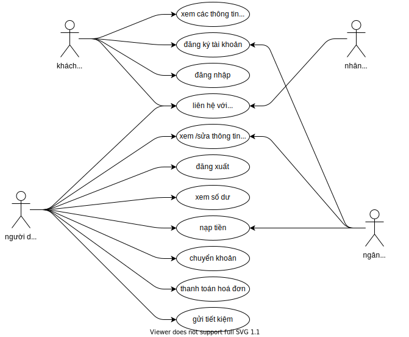
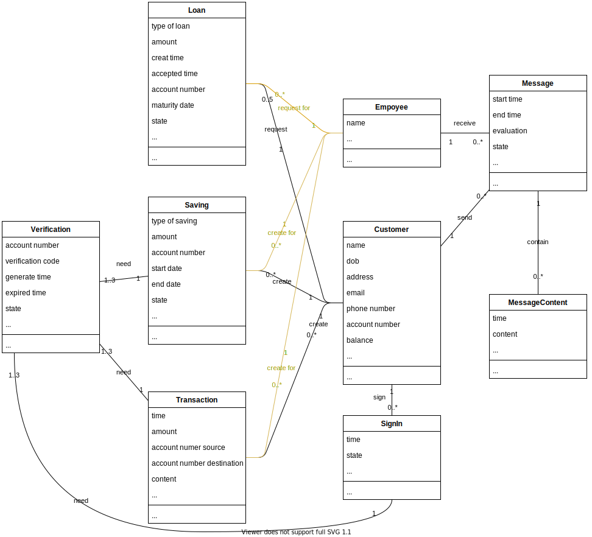

# Ngân Hàng Số

## Giới thiệu

Trong quá trình phát triển của xã hội loài người, khi sản xuất hàng hoá phát triển thì kéo theo sự hình thành và phát triển của các quan hệ thương mại giữa các khu vực, giữa các quốc gia sử dụng các đồng tiền khác nhau. Việc mua, bán, trao đổi hàng hoá giữa các khu vực, giữa các quốc gia sử dụng đồng tiền khác nhau làm nảy sinh nhu cầu đổi tiền. Cùng với sự phát triển của nền văn minh nhân loại, nghề đổi tiền và các dịch vụ kinh doanh tiền tệ cũng phát triển trở thành một nghề kinh doanh và được gọi là nghề ngân hàng. Chúng tôi, ngân hàng số CON MÈO, luôn đi đầu trong ngành về độ tin cậy với các dịch vụ chăm sóc khách hàng tận tình tận tâm. Chúng tôi chuyên cung cấp các dịch vụ gửi tiền; tín dụng có hạn mức cao; thanh toán thẻ và thanh toán online nhanh chóng; cho vay với lãi suất hấp dẫn…

## Đặc tả

### Phần dành cho khách vãng lai

- Khách vãng lai có thể xem các thông tin về ngân hàng như: các thông tin khi đăng ký tài khoản, các dịch vụ ưu đãi, thông tin về lãi suất.
- Khách vãng lai phải đăng ký tài khoản để sử dụng các tính năng của ngân hàng. Sau khi đăng ký, khách vãng lai trở thành người dùng.
- Khi có thắc mắc, khách vãng lai có thể bấm vô nút "Chăm sóc khách hàng" để liên hệ với bộ phận chăm sóc khách hàng thông quan ô chat, hoặc nguời dùng vãng lai gọi điện trực tiếp tới số diện thoại được ghi trên trang.

### Phần dành cho người dùng

- Người dùng được xem mọi thông tin mà khách vãng lai xem được, và có thể liên hệ với bộ phân chăm sóc khách hàng.
- Người dùng được cấp mọt dãy số gọi là số tài khoản. Mọi giao dịch đều dựa trên số tài khoản này.
- Người dùng có thể chỉnh sửa thông tin tài khoản, đăng xuất.
- Để nạp tiền, người dùng mang tiền đến cho nhân viên ngân hàng nhờ nạp hộ.
- Để chuyển tiền cho người khác, người dùng bấm vô phần **Chuyển khoản** và thực hiện các yêu cầu.
- Đẻ thanh toán hoá dơn điện nước của các công ty có liên kết, người dùng bấm vô phần **Thanh toán hoá đơn** và thực hiện các yêu cầu.
- Để gửi tiết kiệm, người dùng bấm vô phần **Gửi tiết kiệm** và thực hiện các yêu cầu.
- Để vay tiền, người dùng bấm vô phần **Tạo khoản vay** và thực hiện các yêu cầu.
- Để xem lịch sử giao dịch, người dùng bấm vô phần **Lịch sử giao dịch**.
- Để sao kê tài khoản, người dùng bấm vô phần **Lịch sử giao dịch**, bấm vô phần **Sao kê** và thực hiện các yêu cầu.

### Phần dành cho nhân viên

- Nhân viên phải đăng nhập vô trang của nhân viên để sử dụng. Tài khoản của nhân viên được cấp bởi chủ ngân hàng.
- Nhân viên được xem các thông tin cá nhân của người dùng và thông tin số dư, nợ, lịch sử giao dịch; và có thể sửa các thông tin cá nhân của người dùng hoặc sao kê nếu được người dùng cho phép.
- Nhân viên nạp tiền hộ khách hàng.
- Nhân viên có thể thực hiện giao dịch hộ người dùng (chuyển khoản, thanh toán hoá đơn, gửi tiết kiệm) nếu được người dùng cho phép.
- Nhân viên tạo khoản vay hộ khách hàng nếu phù hợp với các điều kiện của ngân hàng.
- Nhân viên sẽ thấy được các tin nhắn của khách hàng gửi tới, hoặc cuộc gọi của khách hàng gọi (chăm sóc khách hàng).

### Phần dành cho chủ ngân hàng

- Chủ ngân hàng có thể đăng nhập vô trang của nhân viên (chủ ngân hàng có toàn quyền của nhân viên) hoặc trang của của ngân hàng để sử dụng.
- Chủ ngân hàng có toàn quyền quản lý nhân viên và người dùng.
- Chủ ngân hàng được xem các hoạt động của ngân hàng như tổng tiền gửi, tổng tiền cho vay.
- Chủ ngân hàng được chỉnh sửa các thông tin về lãi suất của ngân hàng.

## Use Case Modelling

## Mô tả Use Case

| **Use Case** | Đăng ký tài khoản |
|---|---|
| **Actors** | Khách vãng lai |
| **Description** | Khách vãng lai đăng ký tài khoản để sử dụng những dịch vụ của ngân hàng |
| **Pre-Conditions** | Đang ở trang chủ |
| **Post-Conditions** | Trang đăng nhập |
| **Main Flow** | 1. Bấm vào nút “Đăng ký” 2. Nhập các thông tin cần thiết, bấm “Tiếp theo" 3. Nhập số tài khoản ngân hàng liên kết, bấm “Xác thực” và thực hiện xác thực 4. Sau khi xác thực thành công, bấm “Hoàn tất” |
| **Alternative Flows** | Không |
| **Exception Flows** | 1. Bấm vào nút “Đăng ký” 2. Nhập các thông tin cần thiết, bấm “Tiếp theo" 3. Nhập số tài khoản ngân hàng liên kết, bấm “Xác thực” và thực hiện xác thực 4. Sau khi xác thực thành công, bấm “Hoàn tất” 5. Khách vãng lai bấm “Huỷ đăng ký” hoặc thoát  |

| **Use Case** | Xem các thông tin về ngân hàng |
|---|---|
| **Actors** | Khách vãng lai |
| **Description** | Khách vãng lai được xem các thông tin về ngân hàng như: các tính năng của ngân hàng, các ưu đãi, lãi suất gửi tiết kiệm |
| **Pre-Conditions** | Không |
| **Post-Conditions** | Không |
| **Main Flow** | Bấm “Trang chủ”, “Hướng dẫn” hoặc “Ưu đãi” để xem thông tin |
| **Alternative Flows** | Không |
| **Exception Flows** | Không |

| **Use Case** | Đăng nhập |
|---|---|
| **Actors** | Người dùng, khách vãng lai |
| **Description** | Người dùng đăng nhập để sử dụng tài khoản ngân hàng của mình |
| **Pre-Conditions** | Đang ở trang chủ |
| **Post-Conditions** | Trang chủ |
| **Main Flow** | 1. Bấm vào nút “Đăng nhập” 2. Nhập tài khoản, mật khẩu, bấm “Đăng nhập” 3. Hệ thống sẽ gửi yêu cầu xác thực, người dùng xác thực |
| **Alternative Flows** | Không |
| **Exception Flows** | 1. Người dùng bấm “Huỷ” hoặc thoát 2. Tài khoản không tồn tại 3. Mật khẩu không đúng 4. Xác thực không hoàn tất |

| **Use Case** | Liên hệ với bộ phận Chăm sóc khách hàng |
|---|---|
| **Actors** | Người dùng, khách vãng lai |
| **Description** | Liên hệ với bộ phận chăm sóc khách hàng khi người dùng hoặc khách vãng lai có thắc mắc cần liên hệ với ngân hàng để giải đáp |
| **Pre-Conditions** | Không |
| **Post-Conditions** | Trang chăm sóc khách hàng |
| **Main Flow** | 1. Bấm vào nút “Chăm sóc khách hàng” 2. Chọn loại liên hệ (số điện thoại/chat) để liên hệ 3. Đối với chat, sau khi liên hệ hoàn tất, bấm vào “Kết thúc” và đánh giá |
| **Alternative Flows** | Khi người dùng nhận được thông báo lỗi trong quá trình sử dụng, sẽ có thông báo “Liên hệ với bộ phận chăm sóc khách hàng kèm với thông báo lỗi”, người dùng bấm vô “Liên hệ” sẽ đi đến trang chat |
| **Exception Flows** | Đối với trang chat, người dùng tắt hoặc bấm “Kết thúc" |

| **Use Case** | Xem/sửa thông tin cá nhân |
|---|---|
| **Actors** | Người dùng |
| **Description** | Người dùng có thể thay đổi các thông tin cá nhân của mình bằng tính năng này |
| **Pre-Conditions** | Đã đăng nhập |
| **Post-Conditions** | Không |
| **Main Flow** | 1. Bấm vào biểu tượng tài khoản 2. Chọn “Thay đổi thông tin cá nhân” 3. Thực hiện các thay đổi, bấm “Lưu” 4. Hệ thống sẽ gửi yêu cầu xác thực, người dùng xác thực |
| **Alternative Flows** | Không |
| **Exception Flows** | 1. Thông tin cá nhân mới trùng với thông tin cũ 2. Xác thực không hoàn tất 3. Người dùng bấm “Huỷ” hoặc thoát |

| **Use Case** | Đăng xuất |
|---|---|
| **Actors** | Người dùng |
| **Description** | Người dùng đăng xuất |
| **Pre-Conditions** | Đã đăng nhập |
| **Post-Conditions** | Trang chủ |
| **Main Flow** | 1. Bám vào biểu tượng tài khoản 2. Chọn “Đăng xuất”  3. Bấm “Xác nhận”  |
| **Alternative Flows** | Không |
| **Exception Flows** | Người dùng bấm “Huỷ” hoặc thoát |

| **Use Case** | Xem số dư |
|---|---|
| **Actors** | Người dùng |
| **Description** | Kiểm tra số tiền còn lại của tài khoản |
| **Pre-Conditions** | Đã đăng nhập |
| **Post-Conditions** | Không |
| **Main Flow** | Chọn “Thông tin tài khoản” và xem số dư |
| **Alternative Flows** | Khi thực hiện giao dịch (nạp tiền, chuyển khoản, thanh toán hoá đơn, gửi tiết kiệm), người dùng sẽ thấy số dư còn lại của mình |
| **Exception Flows** | Không |

| **Use Case** | Nạp tiền |
|---|---|
| **Actors** | Người dùng |
| **Description** | Người dùng nạp tiền từ tài khoản liên kết vô tài khoản của mình |
| **Pre-Conditions** | Đã đăng nhập |
| **Post-Conditions** | Không |
| **Main Flow** | 1. Chọn “Thông tin tài khoản” 2. Chọn “Nạp tiền” 3. Nhập số tiền cần nạp, bấm “Nạp" 4. Hệ thống sẽ gửi yêu cầu xác thực, người dùng xác thực |
| **Alternative Flows** | Khi thực hiện giao dịch, nếu không đủ tiền trong tài khoản, hệ thống sẽ gợi ý người dùng nạp thêm tiền vô tài khoản |
| **Exception Flows** | 1. Người dùng bấm “Huỷ” hoặc thoát 2. Xác thực không hoàn tất 3. Ngân hàng liên kết huỷ giao dịch |

| **Use Case** | Chuyển khoản |
|---|---|
| **Actors** | Người dùng |
| **Description** | Người dùng chuyển tiền của mình cho người khác, hoặc thực hiện giao dịch như mua hàng, … |
| **Pre-Conditions** | Đã đăng nhập |
| **Post-Conditions** | Không |
| **Main Flow** | 1. Chọn “Chuyển khoản” 2. Nhập số tiền cần chuyển, nhập số tài khoản cần chuyển, bấm “Chuyển” 3. Hệ thống sẽ gửi yêu cầu xác thực, người dùng xác thực |
| **Alternative Flows** | Không |
| **Exception Flows** | 1. Người dùng bấm “Huỷ” hoặc thoát 2. Xác thực không hoàn tất 3. Số dư không đủ |

| **Use Case** | Thanh toán hoá đơn |
|---|---|
| **Actors** | Người dùng |
| **Description** | Người dùng có thể thanh toán hoá đơn điện, nước |
| **Pre-Conditions** | Đã đăng nhập |
| **Post-Conditions** | Không |
| **Main Flow** | 1. Chọn “Thanh toán hoá đơn 2. Chọn công ty cung cấp dịch vụ điện/nước, nhập mã khách hàng, bấm “Thanh toán” 3. Hệ thống sẽ gửi yêu cầu xác thực, người dùng xác thực |
| **Alternative Flows** | Không |
| **Exception Flows** | 1. Người dùng bấm “Huỷ” hoặc thoát 2. Xác thực không hoàn tất 3. Số dư không đủ |

| **Use Case** | Gửi tiết kiệm |
|---|---|
| **Actors** | Người dùng |
| **Description** | Gửi tiết kiệm |
| **Pre-Conditions** | Đã đăng nhập |
| **Post-Conditions** | Không |
| **Main Flow** | 1. Chọn “Thông tin tài khoản” 2. Chọn “Gửi tiết kiệm” 3. Chọn loại gửi tiết kiệm (1 năm, 6 tháng, …), chọn số tiền, bấm “Gửi tiết kiệm” 4. Hệ thống sẽ gửi yêu cầu xác thực, người dùng xác thực |
| **Alternative Flows** | Không |
| **Exception Flows** | 1. Người dùng bấm “Huỷ” hoặc thoát 2. Xác thực không hoàn tất 3. Số dư không đủ |

| **Use Case** | Liên hệ với bộ phận Chăm sóc khách hàng |
|---|---|
| **Actors** | Bộ phận chăm sóc khách hàng |
| **Description** | Nhân viên thuộc bộ phận chăm sóc khách hàng sẽ thấy các yêu cầu mà khách hàng gửi đến (chat/cuộc gọi) |
| **Pre-Conditions** | Đã đăng nhập |
| **Post-Conditions** | Không |
| **Main Flow** | Đối với chat, sau khi nhận được yêu cầu chat từ khách hàng 1. Chọn khách hàng trong danh sách khách hàng đang chờ được tư vấn  2. Sau khi tư vấn, nhân viên chọn “Kết thúc” để kết thúc phiên tư vấn |
| **Alternative Flows** | Không |
| **Exception Flows** | Khách hàng/nhân viên thoát ra

## Conceptual Modelling (Class Diagram)

